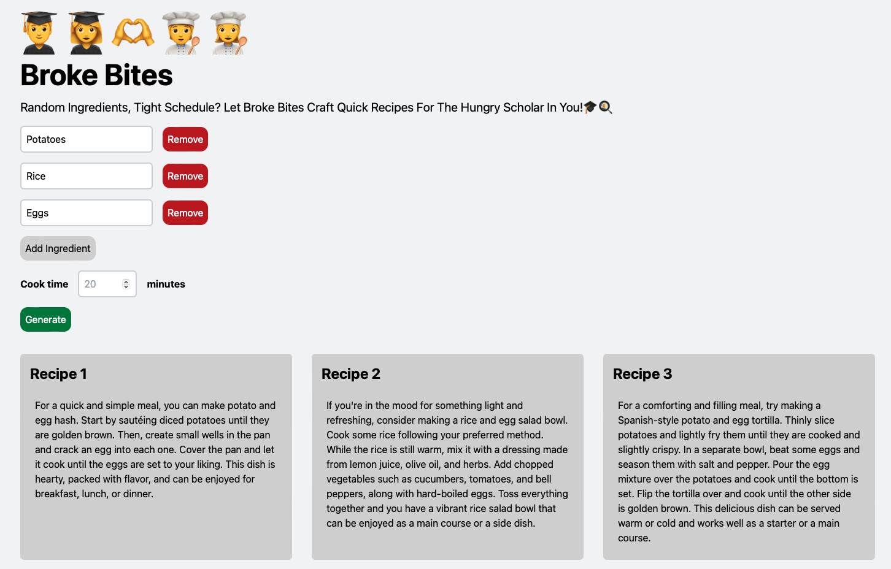

# Broke Bites 🧑‍🍳

Oi, students! Short on cash but still want a banging meal? Enter Broke Bites - the web app that conjures up recipes with whatever you've got lying around and the precious few minutes you can spare between lectures. Powered by OpenAI API, Next.js, and Tailwind CSS. And remember, if I can teach grown chefs to not ruin a steak, I'm sure you can cook up something decent with this tool.

The app was showcased in the blindingly brilliant workshop, "How to build an AI app," led by Elena Lape at the fantastic Hack the Burgh 2023 event on 4-5 March 2023.

Put your eyes on this - 

## Prerequisites

You're going to need [Node.js](https://nodejs.org/en/download/). Just get it sorted on your machine.
An [OpenAI account & API key](https://platform.openai.com/account/api-keys). It's not rocket science; just sign up.

## Built with

- [Next.js](https://nextjs.org/): Think of it as the unsung hero behind many great dishes — it's a bloody useful React framework.
- [Tailwind CSS](https://tailwindcss.com/): Makes your CSS life a lot less miserable with its shortcodes.
- [OpenAI API](https://openai.com/): The magic wand that spins words and pictures out of thin air. Absolutely stunning!

## Running locally

1. Stop mucking about! Clone the repo:
git clone

2. Whip out the ingredients - Install those dependencies:
npm install

3. Right, you're going to need to set up your secret sauce. Create an .env file in the root directory and slap in your OpenAI API key, which, if you were paying attention earlier, you'd know to grab from here.
// .env
OPENAI_API_KEY=sk-xxxxxxx

4.Light the stoves! Let's get this app running:
npm run dev

Check out your masterpiece at http://localhost:3000. And trust me, if it doesn't work, it's probably something you did, not the app!
